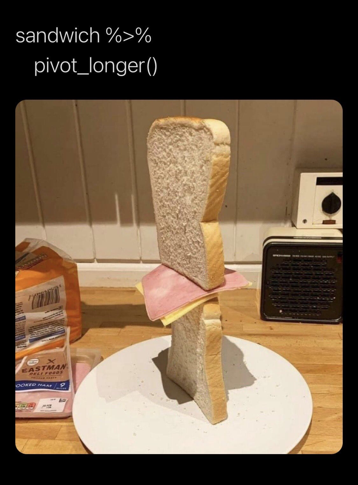

```{r setup, include=FALSE}
knitr::opts_chunk$set(fig.width=6, fig.asp = 0.618, collapse=TRUE) 
```

### Unit 4: Fisheries
#### Lesson 1: Joins and shape
#### New functions: left_join(), right_join(), inner_join(), full_join(), semi_join(), anti_join(), gather(), spread()

***

### Fisheries relational database

In this module we will examine fisheries stock assessment data and identify collapsed fisheries. We will be using the RAM Legacy Database, a massive dataset of fisheries metrics across the globe: 

https://www.ramlegacy.org/

The RAM database has over 50 tables with a range of sizes and shapes, and we will be using several of them. The chief table we will be utilizing has over 1 million rows. Each of the tables are connected by a series of IDs that can be used to merge data appropriately. To manage this massive relational database, we will first get comfortable with the join operations in `dplyr`.

### Joins

There is a great cheet-sheet that goes over joins and other data shaping functions:
In the RStudio top menu: `Help -> Cheatsheets -> Data Tranformation with dplyr`
or here: https://rstudio.com/wp-content/uploads/2015/02/data-wrangling-cheatsheet.pdf

Here we will learn how to merge data with the join functions of the `dplyr` package. There are 2 types of joins: 

-  **Mutating joins** add new variables to one table from matching observations in another table
-  **Filtering joins** filter observations from one table based on whether or not they match an observation in the other table

dplyr join functions:

- Mutating joins:
  + **left_join:** Join matching rows from data_2 to data_1
  + **right_join:** Join matching rows from data_1 to data_2.
  + **inner_join:** Join data. Retain only rows in both sets.
  + **full_join:** Join data. Retain all values, all rows.
- Filtering joins: 
  + **semi_join:** Return all rows in data_1 that have a match in data_2.
  + **anti_join:** Return all rows in data_1 that do not have a match in data_2..

We will examine these different types of joins using very simple example data.

Example data:

```{r, message=FALSE}
library(tidyverse)
data1 <- data.frame(ID = 1:2,                      # Create first example data frame
                    X1 = c("a1", "a2"),
                    stringsAsFactors = FALSE)
data2 <- data.frame(ID = 2:3,                      # Create second example data frame
                    X2 = c("b1", "b2"),
                    stringsAsFactors = FALSE)
```

The figure below illustrates what our two data frames look like and how we can merge them based on the different join functions of the `dplyr` package. On the top of the figure you can see the structure of our example data frames. Both data frames contain two columns: The ID and one variable. Note that both data frames have the ID No. 2 in common. On the bottom row of the figure you can see how each of the join functions merges our two example data frames.

{width=50%}

### Left joins

This is the join that I use most frequently. The `left_join()` returns all rows from data1 and all columns from data1 and data2. Rows in data1 with no match in data2 will have `NA` values in the new columns. If there are multiple matches between data1 and data2, all combinations of the matches are returned. If the joining variable that links your two data frames, you don't need to explicitly identify what that joining variable is. 

```{r}
# 3 equivalent ways to perform the left_join():

# Without specifying the joining variable:
data12_left = left_join(data1, data2)
# Explicitly specifying the joining variable:
data12_left = left_join(data1, data2, by="ID")
# With piping
data12_left = data1 %>%
  left_join(data2, by="ID")
data12_left

```

{width=50%}

The function `right_join()` is equivalent to `left_join()` but reverses the order of the 2 data frames (i.e. all of the rows in the "right" or second data frame are preserved).

### Inner join

The function `inner_join()` returns all rows from data1 where there are mathching values in data2, and all columns from data1 and data2. If there are multiple matches between data1 and data2, all combinations of the matches are returned. 

```{r}
data12_inner = data1 %>%
  inner_join(data2, by="ID")
data12_inner
```

{width=50%}

### Full join

The function `full_join()` returns all rows and columns from both data1 and data2. The function returns `NA` for any missing values.

```{r}
data12_inner = data1 %>%
  full_join(data2, by="ID")
data12_inner
```

{width=50%}

### Semi join

The function `semi_join()` is a filtering function, so no new columns are created in data1, but rows are removed from data1. `semi_join()` returns all rows from data1 where there are matching values in data2, but only keeps the columns in data1. A semi join will never duplicate rows of data1, even if there is more than one matching row in data2. 

```{r}
data12_semi = data1 %>%
  semi_join(data2, by="ID")
data12_semi
```

{width=50%}

### Anti join

The `anti_join()` function returns all rows from data1 where there are NOT matching values in data2, keeping just the columns from data1. 

```{r}
data12_anti = data1 %>%
  anti_join(data2, by="ID")
data12_anti
```

{width=50%}

### Words of wisdom

Whenever I use a join function, I **always** check the dimensions using `dim()` of my data frames before and after the joins to make sure I understand what rows and columns were added. You can also use the `summary()` function, or use `filter()` combined with `is.na()` to check for `NAs` so that you have a good sense of what data are missing after a join.

***

### Exercise 1.1

Let's imagine you had a month of scuba survey data where each row was a different fish that was observed on a rocky reef. The fish survey data includes the fish's common name, size, date, reef site and observation ID. Then you have a second data frame that has encylopedia-type data downloaded from fishbase.org with common name, genus, species, trophic level and maximum length. If your goal was to add the genus and species information to your survey data and then count the total number of each species observed at a reef, what join would you use? What variable would you join the data frames by? What would happen if there were multiple rows in your fishbase data frame corresponding to the same common name (perhaps one row included a max length estimate pulled from Miller et al. and another row included a max length pulled from Garcia et al.)? Could that mess up your scuba survey analysis?

***

### Switching between long and wide data frames

The functions `pivot_longer()` and `pivot_wider()` (formally called `gather()` and `spread()`) in `dplyr` are used to change the shape of a table from wide to long and from long to wide. This can be an important step for preparing your data for specific types of analysis. For example, a lot of PCA / EOF / nmds analysis packages require data to be in a wide format where different types of observations have their own columns However, many of ggplot's really slick features work best when data is in a long format. 

To look at these two functions, we'll create some more example data. Let's pretend you are counting invertebrates that fall inside of a quadrat in the intertidal. Your data might look like this:

```{r}
survey = data.frame(quadrat_id = c(101, 102, 103, 104),
                    barnacle_n = c(2, 11, 8, 27),
                    chiton_n = c(1, 0, 0, 2),
                    mussel_n = c(0, 1, 1, 4))
```

This is the "wide" format, because each type of observation has its own column. The `pivot_longer()` function is used to convert this data to the long format. You will select a subset of columns to stack on top of each other that can be passed to the `cols` parameter as a vector of column names (strings). Set the `names_to` parameter to the name of the new column that will contain the old column names. Set the `values_to` parameter to the name of the new column that will contains the elements associated with each former column. Note that the columns that are not selected in `pivot_longer()` will be retained, and their values will be repeated.

```{r}
long = survey %>% 
  pivot_longer(cols=c("barnacle_n", "chiton_n", "mussel_n"), names_to="taxon", values_to="counts")
head(long)
```

Then we can take long data and convert it to wide data for analysis with the `pivot_wider()` function. This time, identify the `names_from` parameter as the column that will become column names and the `values_from` parameter as the column that holds the data that will fill each new column. 

```{r}
wide = long %>%
  pivot_wider(names_from=taxon, values_from=counts)
head(wide)
```

{width=40%}

***

### Exercise 1.2

When the invertebrate survey is in the original (wide) format, use ggplot to create a scatter plot where the quadrat_id is along the x-axis and the count data is along the y-axis. Give each different taxon a different point color. Now create the same exact plot using the survey data in the long format.

If you wanted to build a linear model to predict the number of barnacles in a quadrat as a function of the number of other invertebrates that were found in the quadrat (i.e. chitons and mussels), what table shape would you need, long or wide?

***

### Acknowledgments 

This lesson and the helpful graphics were adapted from Joachim Schork's blog: https://statisticsglobe.com/r-dplyr-join-inner-left-right-full-semi-anti
