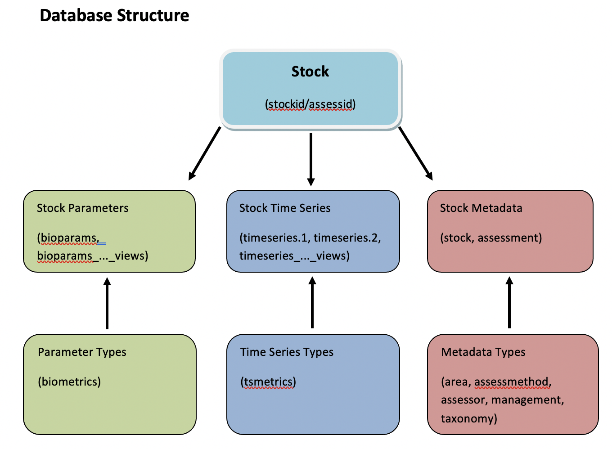

```{r setup, include=FALSE}
knitr::opts_chunk$set(fig.width=6, fig.asp = 0.618, collapse=TRUE) 
```

### Unit 4: Fisheries
#### Lesson 2: Using joins for a relational database

***

### Fisheries Data

In this unit we will be using the RAM Legacy Database: 

https://www.ramlegacy.org/

The RAM Legacy Stock Assessment Database is a compilation of stock assessment results for commercially exploited marine populations from around the world. It is inspired by Dr. Ransom A. Myers’ original stock-recruitment database, which is no longer being updated.

Go to the RAM Legacy website and click through to download the latest version of the RAM data from Zenodo. The data (rather inefficiently, if you ask me) is delivered in multiple formats simultaneously, including Microsoft Excel files and RData files. Since we are using R, I'm going to load the RData file using the `load()` function.

Note: Usually when I receive Excel files, I convert them to `.csv` files and read them in with `read.csv()`, but there is also an R package to load Excel files directly into R called `readxl`. 

```{r}
load('data/RAMLDB v4.495/R Data/DBdata[asmt][v4.495].RData')
```

The RAM data is structured as a large relational database which contains many different tables of different sizes and shapes, and the tables are related to each other through a series of different ids. The database has over 50 tables and some tables have over 1 million rows. This data (and many other super valuable massive datasets just like this) is difficult to work with and maneuver at first. I'm going to show you what metadata files I used to get familiar with the database so that I could start this fisheries analysis. 

From the `Database Quick Guide` document, we find out that the `biometrics` table describes all parameter types available in the `bioparams` table, and the `tsmetrics` table describes all time series types available in the `timeseries` table. A simple version of the most commonly used fisheries metrics by stock and by year is available in `timeseries_values_views`. Then if we look in the `Database Structure` document, there is a map that generally shows how the major types of tables are connected:

{width=50%}


Looking deeper in the `Database Structure` document, there is a table called "Table Linkages" that lists which IDs can be used to link the different tables. For example, both the `timeseries_values_views` table and `stock` table have a common ID called `stockid`. 

The other good metadata file provided is called `Database Table Fields`. This is a spreadsheet that provides explanations for the variable names that represent the broad range of fishery metrics presented in this dataset. Now that we have glanced through the metadata, we can start a fisheries analysis.

### Annual total catch by stock

We are going to look in the `timeseries_values_views` dataset for annual total catch for each fish stock. The `TCbest` column is the best available annual total catch data (in metric tons). The actual data is all in `timeseries`, but the `timeseries` table may have multiple stock assessments for a given year, which complicates things. We'll stick with the simplified `timeseries_values_views` table. if we join it with the `stock` dataset then we can add more information about each stock, such as `scientificname` and `region`.

```{r, message=FALSE}
library(tidyverse)
```

```{r}
unique(timeseries_units_views$TCbest) # All TCbest units are in metric tons

# Join timeseries_values_views, stock and taxonomy tables
fish = timeseries_values_views %>%
  left_join(stock, by=c("stockid", "stocklong")) %>%
  left_join(taxonomy, by = c("tsn", "scientificname")) %>% # could join metadata table instead
  select(stockid, stocklong, year, TCbest, tsn, scientificname, commonname, region, FisheryType, taxGroup)

# Fishery with heighest annual catch
glimpse( fish %>% arrange(desc(TCbest)) ) # what had the highest catch?

# Compare: 
# https://www.ramlegacy.org/explore-the-database/regions/us-east-coast/
# data/RAMLDB v4.495/Stock Summary Files/USEastCoastSummaryFile[asmt][v4.495].pdf
# latest version Acadian redfish GOM/GB was multiplied by 1000 by accident??
# let's drop it to be safe
fish = fish %>%
  filter(stockid != "ACADREDGOMGB")

# This plot has LOTS of data - make sure you remove the legend !!
ggplot() +
  geom_line(aes(x=year, y=TCbest, color=stockid), data=fish) +
  theme(legend.position = "none")
ggsave('figures/total_catch_all_stocks.png', device="png", height=4, width=7, units="in")
```

### Cod collapse

Now that we have created a nice neat data set of all of the best available time series of total catch for fisheries all around the world, we can take a more detailed look at specific stocks. Let's examine the infamous collapse of the Canadian cod stock. 

Newfoundland and Labrador's historic cod fisheries attracted local and international fishing fleets for almost five centuries before the Canadian government shut the industry down indefinitely in July 1992. By then, once-plentiful fish stocks had dwindled to near extinction and officials feared they would disappear entirely if the fisheries remained open. The moratorium put about 30,000 people in the province out of work and ended a way of life that had endured for generations in many port communities. It also made evident the vulnerability of marine resources to overexploitation and that existing regulatory regimes were insufficient to protect cod stocks.

Let's isolate the cod stock assessments in East Coast Canada and add them together. Then we can plot a time series of the total Canadian East Coast cod stock and try to see what the collapse looked like.

```{r}
# What regions have Atlantic cod stock assessments?
cod = fish %>% 
  filter(scientificname == "Gadus morhua") %>%
  distinct(region)

# Sum best Total Catch estimates for Cod across all Canada East Coast stock assessments       
cod = fish %>% 
  filter(scientificname == "Gadus morhua",
         region == "Canada East Coast", 
         !is.na(TCbest)) %>%
  group_by(year) %>%
  summarise(total_catch = sum(TCbest)) 

# Plot Canada East Coast cod total catch time series
ggplot(aes(x=year, y=total_catch), data=cod) + 
  geom_line() +
  labs(x= "Year", y= "Total Catch (Metric Tons)", 
       title = "Cod Total Catch in East Canadian Coast")
```

A paper by Boris Worm et al. (2006; see the readings directory) defines a fishery stock collapse as a decline in total catch to less than 10% of the maximum historical total catch. Did the Eastern Canadian cod stock "collapse" according to this definition? We'll use the `cummax()` function which returns the maximum value in all rows of a data frame previous to a particular row, to find the historical maximum (i.e. the max catch observed prior to each year within the analysis). We can identify the year the collapse occurred and add that to our time series plot.

```{r}
dat = c(1,3,6,2,3,9,-1)
cummax(dat) # cummax() returns the cumulative maximum value
cumsum(dat) # cumsum() returns the cumulative sum value

# Find the historical max total catch for each year in the time series
# Define collapse as a total catch <= 10% of the historical max catch
# cummax() in row i provides the max value in rows 0 - i
cod_collapse = cod %>%
  mutate(historical_max_catch = cummax(total_catch),
         collapse = total_catch <= 0.1*historical_max_catch) 

# What year did the collapse happen?
cod_collapse_year = cod_collapse %>% 
  filter(collapse==TRUE) %>% 
  summarize(year=min(year)) %>% 
  pull(year)

# Plot the catch time series and the collapse year
ggplot() + 
  geom_line(aes(y=total_catch, x=year, color=collapse), data=cod_collapse) +
  geom_vline(xintercept = cod_collapse_year) + # Draws vertical line
  #scale_x_continuous(breaks=c(seq(0,2015,10))) + # Add more breaks on x axis
  xlab("Total catch (Mt)") + ylab("Year") + ggtitle("East Canada Cod")
```

### Examine fishery collapse across ALL stocks

Now that we have explored what a stock collapse looks like with cod in Eastern Canadian waters, let's look at the whole RAM dataset and count the number of stocks that have collapsed. How do stock collapse events change through time? How do they change by geographic region?

```{r}
# Find all stocks that have collapsed
collapse = fish %>% 
  filter(!is.na(TCbest)) %>%  # Remove NAs (which can't be ignored with cummax())
  group_by(stocklong) %>%
  mutate(historical_max_catch = cummax(TCbest),
         current_collapse = TCbest < 0.10 * historical_max_catch,
         collapsed_yet = cumsum(current_collapse) > 0) %>%
  ungroup()

# Find the year each stock collapsed for the first time
collapse_yr = collapse %>%
  group_by(stockid, stocklong, region) %>% # really just groups by stockid, but retains region
  filter(collapsed_yet == TRUE) %>%
  summarize(first_collapse_yr = min(year)) %>%
  ungroup()

# Plot a histogram of first collapse year
ggplot(data = collapse_yr, aes(x=first_collapse_yr)) +
  geom_histogram(color="black", fill="white", binwidth=5) # bin into 5-yr-intervals

# Create a time series of # of stocks ever collapsed / total stocks
n_stock_assessments = length(unique(collapse$stockid))
collapse_ts = collapse_yr %>%
  count(first_collapse_yr) %>% # Count number of stocks that collapsed each yr
  mutate(cum_first_collapse_yr = cumsum(n),
         ratio_collapsed_yet = cum_first_collapse_yr/n_stock_assessments)

ggplot(data = collapse_ts, aes(x=first_collapse_yr, y=ratio_collapsed_yet)) +
  geom_line()
```

*** 

### Exercise 2.1

Create the same time series that shows the # of stocks that have collapsed (historically) divided by the total number of stocks that are tracked in the dataset. However, show this plot separately for EACH region. You may need to create a new data frame that counts the number of stocks tracked in each region, then join that new data frame to the collapse_ts data frame to calculate your ratios.

***


